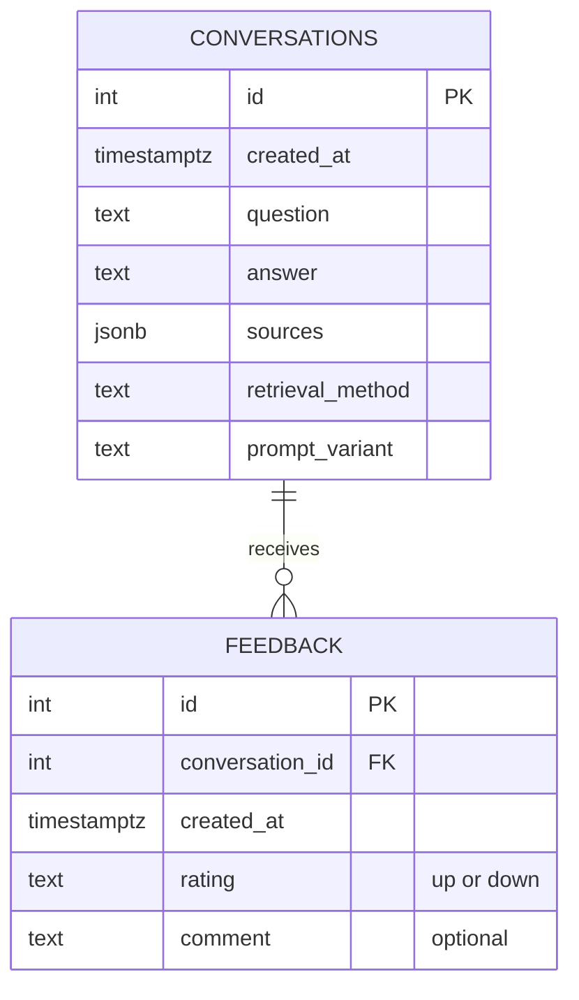

# 🐄 Cattle Raising Assistant

An AI-powered RAG (Retrieval-Augmented Generation) assistant that helps cattle producers quickly consult INTA's (Instituto Nacional de Tecnología Agropecuaria) technical studies on animal health, instead of manually searching through long, scattered PDF reports.

## 📑 Table of Contents

- [❓ Problem Description](#-problem-description)
- [🏗️ Project Architecture](#️-project-architecture)
- [🖥️ Technologies Used](#️-technologies-used)
- [📊 Retrieval Evaluation](#-retrieval-evaluation)
- [🤖 LLM Evaluation](#-llm-evaluation)
- [🗄️ Database Schema](#️-database-schema)
- [📈 Monitoring](#-monitoring)
- [💬 Sample Questions](#-sample-questions)
- [🖇️ Running the Project](#️-running-the-project)
- [🛠️ Reproducibility](#️-reproducibility)
- [🔮 Roadmap](#-roadmap)
- [🪐 About the Author](#-about-the-author)

## ❓ Problem Description

INTA (Argentina's national agricultural technology institute) publishes valuable technical research on cattle health — disease prevention, parasite identification, drought impact on livestock, vaccination guidelines, and more. This information is critical for producers, but it lives scattered across dozens of long, dense PDF reports that are not designed for quick lookup. A producer facing a concrete, time-sensitive question (e.g. "what tick species affect cattle in my region?" or "how does drought affect weight gain?") has to manually search through multiple documents to find a reliable, sourced answer.

This project addresses that gap by building an AI agent that:

- **Indexes** INTA's technical PDF reports on cattle health as a searchable knowledge base.
- **Retrieves** the most relevant passages for a producer's question, evaluated and chosen from multiple retrieval strategies rather than assumed.
- **Generates** a grounded, Spanish-language answer with explicit source citations (document and page), so producers can verify the information and go back to the original report if needed.
- **Stays within safe boundaries** for a health-adjacent domain: the assistant does not diagnose animals or prescribe treatment/dosage, and it explicitly recommends consulting a veterinarian for those cases.

## 🏗️ Project Architecture

The full pipeline:

1. **Data extraction**: source PDFs from INTA are processed and split into page-level chunks, stored as JSONL (`data/processed/chunks.jsonl`).
2. **Ingestion automation**: the extraction → chunking → embedding pipeline is orchestrated with **Kestra**, running inside Docker and sharing a volume with the API. It can be triggered manually or on a weekly schedule, instead of being run by hand in a notebook.
3. **Retrieval**: three strategies were implemented and evaluated — keyword search (BM25), vector search (Gemini embeddings), and hybrid search (Reciprocal Rank Fusion of both). See [Retrieval Evaluation](#-retrieval-evaluation).
4. **Generation**: a RAG module (`src/generation/rag.py`) builds a grounded prompt from the retrieved chunks and generates an answer with the Groq API (Llama 3.3 70B), including citation formatting and domain safety rules.
5. **Evaluation**: both retrieval and generation are measured quantitatively rather than assumed — see the evaluation sections below, and the full write-up in [`docs/experiments.md`](docs/experiments.md).
6. **Interface**: a FastAPI application (`main.py`) exposes the assistant through `POST /ask` and `POST /feedback`, plus a `GET /health` liveness check, with interactive docs at `/docs`.
7. **Monitoring**: every conversation and piece of user feedback is logged to Postgres, visualized in a Streamlit dashboard. See [Monitoring](#-monitoring).
8. **Containerization**: the API, Postgres, the dashboard, and Kestra all run together via a single `docker-compose.yml`.

## 🖥️ Technologies Used

- Python 3.x
- [uv](https://docs.astral.sh/uv/) — package and project management
- Google Gemini API — `gemini-embedding-2`, used only for vector search embeddings
- [Groq API](https://console.groq.com/) — `llama-3.3-70b-versatile`, used for answer generation and LLM-as-a-judge evaluation (fast, free-tier friendly)
- [rank_bm25](https://pypi.org/project/rank-bm25/) — BM25 keyword retrieval
- [FastAPI](https://fastapi.tiangolo.com/) — HTTP interface (`POST /ask`, `POST /feedback`, `GET /health`)
- [PostgreSQL](https://www.postgresql.org/) — stores conversations and user feedback
- [Streamlit](https://streamlit.io/) — monitoring dashboard
- [Kestra](https://kestra.io/) — orchestrates and automates the ingestion pipeline
- Docker & Docker Compose — the full stack (API, Postgres, dashboard, Kestra) runs as one unit

## 📊 Retrieval Evaluation

Three retrieval strategies were compared against a 10-question ground truth set, using Hit Rate@5 and MRR as metrics:

| Method | Hit Rate@5 | MRR |
|---|---|---|
| Keyword (BM25) | 100% | **0.817** |
| Vector (Gemini embeddings) | 90% | 0.587 |
| Hybrid (RRF of keyword + vector) | 100% | 0.770 |

**BM25 keyword search was chosen for production**, based on the highest MRR. This is a domain-specific finding: the ground truth questions use precise technical vocabulary that tends to match the source text literally, favoring lexical search over semantic search in this corpus. Hybrid search was evaluated but not selected — full reasoning, and the initial BM25 bug that was found and fixed along the way, are documented in [`docs/experiments.md`](docs/experiments.md).

## 🤖 LLM Evaluation

Generated answers are scored using an **LLM-as-a-judge** approach: for each question, a judge model (Groq, `llama-3.3-70b-versatile`) rates the generated answer on two axes — *relevance* (does it answer the question) and *groundedness* (is every claim backed by the retrieved context, with no invented information). Two prompt variants were compared, over the full 10-question set:

| Prompt | Relevant | Grounded |
|---|---|---|
| A (detailed — numbered rules + citation example) | 90% | 100% |
| B (concise — same constraints, one short paragraph) | 90% | 100% |

**The two prompts tied exactly.** Prompt A was kept for production: with equal measured quality, the detailed prompt's worked citation example is expected to generalize better to questions outside this 10-question sample, where citation formatting is more likely to drift without an example to anchor it. One question was not answered relevantly by either prompt — noted as a known limitation rather than something worth over-fitting the prompt to fix from a single case. Full reasoning is in [`docs/experiments.md`](docs/experiments.md).

## 🗄️ Database Schema

Every question the API answers is logged, and every piece of feedback a user gives is linked back to the conversation it's about:



- **`conversations`**: one row per `/ask` request — the question, the generated answer, its cited sources (as JSON), and which retrieval method / prompt variant produced it (useful if that ever changes, or if a bug silently switches it).
- **`feedback`**: one row per `/feedback` request, referencing the `conversations` row it rates. A conversation can receive zero, one, or more feedback entries.

## 📈 Monitoring

Two things happen automatically as the API is used:

1. **Every conversation is logged** to the `conversations` table (see [Database Schema](#️-database-schema)).
2. **User feedback is collected** via `POST /feedback` (thumbs up/down + optional comment), stored in the `feedback` table.

A **Streamlit dashboard** (`src/monitoring/dashboard.py`, served at `:8501`) reads live from Postgres and renders 6 charts:

1. Conversations per day
2. Feedback: positive vs. negative
3. Retrieval method used (flags it visually if anything other than BM25 is ever used)
4. Prompt variant used (same idea, for prompt A vs. B)
5. Average answer length per day
6. Most frequently asked questions

The dashboard uses a green/yellow color theme (`.streamlit/config.toml`) matching the agricultural domain of the project.

## 💬 Sample Questions

Questions to try against `POST /ask` (via `/docs` or curl). **The assistant always answers in Spanish**, regardless of whether the question is asked in English or Spanish — this is a deliberate design choice, since the target users (Argentine cattle producers) are Spanish speakers; the bilingual list below is meant for demoing the assistant to a non-Spanish-speaking audience.

### On-topic (grounded in the INTA documents)

| # | English | Español |
|---|---|---|
| 1 | What tick species can affect cattle? | ¿Qué especies de garrapatas pueden afectar al ganado? |
| 2 | How does drought affect cattle weight gain? | ¿Cómo afecta la sequía a la ganancia de peso del ganado? |
| 3 | What diseases does bovine alphaherpesvirus type 1 cause? | ¿Qué enfermedades causa el alfaherpesvirus bovino tipo 1? |
| 4 | Does ivermectin have antiviral effects in cattle? | ¿Tiene la ivermectina efectos antivirales en el ganado? |
| 5 | What symptoms indicate a tick infestation in cattle? | ¿Qué síntomas indican una infestación de garrapatas en el ganado? |

### Off-topic (unrelated to the project — should trigger the "insufficient information" safeguard, not a hallucinated answer)

| # | English | Español |
|---|---|---|
| 1 | What's the capital of France? | ¿Cuál es la capital de Francia? |
| 2 | Can you write me a poem about the ocean? | ¿Podés escribirme un poema sobre el océano? |
| 3 | How do I fix a JavaScript syntax error? | ¿Cómo soluciono un error de sintaxis en JavaScript? |

The off-topic set is a quick manual check that the assistant stays grounded: it should say the available documents don't cover the topic, rather than answering from the model's general knowledge.

## 🖇️ Running the Project

### With Docker (recommended — runs the full stack)

```bash
docker compose up --build
```

This starts all four services:

| Service | URL | What it is |
|---|---|---|
| `api` | http://localhost:8000 | FastAPI — redirects to `/docs` |
| `postgres` | localhost:5432 | Conversation + feedback storage |
| `dashboard` | http://localhost:8501 | Streamlit monitoring dashboard |
| `kestra` | http://localhost:8080 | Ingestion pipeline orchestration UI |

A `.env` file with the required keys (see [Reproducibility](#️-reproducibility)) must exist in the project root before running this.

### API only, without Docker

```bash
uv run uvicorn main:app --reload
```

Open **http://127.0.0.1:8000/docs** for the interactive Swagger UI, or send a request directly:

```bash
curl -X POST http://127.0.0.1:8000/ask \
  -H "Content-Type: application/json" \
  -d '{"question": "¿Qué efectos tuvo la sequía sobre la ganancia de peso de los bovinos?"}'
```

(Note: without Docker, Postgres/Monitoring won't be available unless you run it separately.)

## 🛠️ Reproducibility

### Prerequisites

- [Python](https://www.python.org/downloads/) 3.12 or higher
- [uv](https://docs.astral.sh/uv/) — Python package and project manager
- [Docker Desktop](https://www.docker.com/products/docker-desktop/) — to run the full stack
- A Google Gemini API key ([Google AI Studio](https://aistudio.google.com/)) — used for embeddings only
- A Groq API key ([console.groq.com](https://console.groq.com)) — used for generation and evaluation, free tier, no credit card required

### Setup

```bash
git clone https://github.com/Camila20197/cattle-raising-assistant.git
cd cattle-raising-assistant
uv sync
```

Create a `.env` file in the project root:

```
GEMINI_API_KEY=your-gemini-api-key-here
GROQ_API_KEY=your-groq-api-key-here
POSTGRES_USER=app_user
POSTGRES_PASSWORD=choose-a-password
POSTGRES_DB=cattle_assistant
```

### Running the evaluations

```bash
# Retrieval evaluation (keyword vs vector vs hybrid)
uv run python -m src.tests.evaluate_retrieval

# LLM evaluation (prompt A vs prompt B, LLM-as-a-judge)
uv run python -m src.tests.evaluate_llm
```

> `evaluate_llm.py` is resumable: results are saved after every question, so if it's ever interrupted (rate limits, network issues), re-running the same command picks up where it left off instead of repeating already-scored questions.

### Running the ingestion pipeline

The pipeline (`src/ingestion/run_ingestion.py`) is orchestrated by a Kestra flow (`cattle_health_ingestion`). With the stack running (`docker compose up`), open the Kestra UI at `http://localhost:8080`, open the flow, and click **Execute** — or wait for its weekly schedule.

## 🔮 Roadmap

Ideas for future improvement, beyond what's built:

- **Improve the interface**: the current interface is a functional API (FastAPI + Swagger docs). A next step would be a proper chat-style front end (e.g. a simple web UI) so non-technical producers can use the assistant directly, without going through `/docs` or `curl`.
- **Improve ingestion to pull updates automatically from INTA's website**: today, ingestion re-processes whatever PDFs are already in `data/raw/`. A more complete version would have the Kestra flow check INTA's publications page for new reports and download them automatically, so the knowledge base stays current without anyone manually adding files.
- **Best practices**: evaluate document re-ranking and query rewriting (hybrid search is already evaluated — see [Retrieval Evaluation](#-retrieval-evaluation)).
- **Cloud deployment**: deploy to Google Cloud Platform, provisioned with Terraform, with dbt for any warehouse-side transformations. This would also unblock a live BigQuery + Looker Studio connection for Monitoring, instead of the local Postgres + Streamlit setup used today.
- **API deployment to Cloud Run**: a deployment of the API to Google Cloud Run was attempted but did not succeed — the build completed successfully and the same image runs correctly via Docker Compose, but the revision failed with a generic "Container import failed" error at the Cloud Run platform level, with no application logs produced (the container never reached the point of starting Python). Getting this working is expected to be revisited in the future, with more time to investigate the platform-level cause.

## 🪐 About the Author

I am a Data Processing and Analytics Engineering student at the Universidad Nacional de Entre Ríos (UNER) in Argentina, with experience in Python, SQL, and data architecture. This project combines that background with an interest in applying LLMs and RAG to a real, practical problem for agricultural producers.

👩‍💻 Connect with me on LinkedIn: [Camila Durand](https://www.linkedin.com/in/camila-ayelen-durand/)
